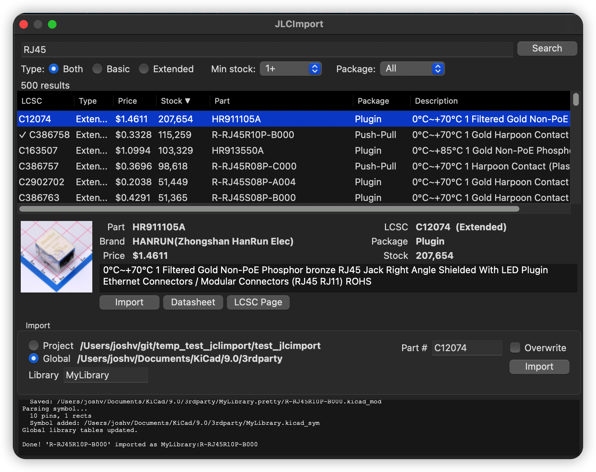

# JLCImport

JLCImport is a KiCad action plugin that imports symbols, footprints, and 3D models from SZLCSC/JLCPCB into your project or global library.

## Features

- Imports symbol, footprint, and 3D model data in one step.
- Works with project libraries or global KiCad libraries.
- Includes searchable part lookup with stock and type filtering.
- Handles modern KiCad formats (8/9/10).
- Ships with plugin, CLI, GUI, and TUI workflows.



## Install

1. Open KiCad and go to **Tools > Plugin and Content Manager**
2. Open repository settings and add:
   `https://github.com/harry10086/kicad_jlcimport/releases/latest/download/repository.json`
3. Refresh repositories
4. Install **JLCImport**

Fallback: install from ZIP using [Releases](https://github.com/harry10086/kicad_jlcimport/releases) (`JLCImport-vX.X.X.zip`, not "Source code" ZIP).

For local development, link `src/kicad_jlcimport` into your KiCad plugin directory and restart KiCad.

## Use In KiCad

Open `PCB Editor > Tools > External Plugins > JLCImport`.

1. Search for a part.
2. Pick Project or Global destination.
3. Set library name if needed.
4. Click Import.

If `sym-lib-table` or `fp-lib-table` is created for the first time, reopen the project once.

## CLI, GUI, And TUI

This repo also ships standalone tools:

- `jlcimport-cli` for scripts and batch work.
- `jlcimport-gui` for a desktop app outside KiCad.
- `jlcimport-tui` for terminal workflow.

Quick examples:

```bash
jlcimport-cli search "100nF 0402" -t basic
jlcimport-cli import C427602 -p /path/to/project
jlcimport-gui -p /path/to/project
jlcimport-tui --kicad-version 9
```

Create or activate the local environment with:

```bash
source install.sh      # macOS/Linux
. .\install.ps1        # Windows PowerShell
```

## Recent Updates

Based on recent git history:
- `v1.4.1`：把 LCSC 改成了国内 szlcsc.com，速度更快。但每次加载数量减少到100,因为国内网站有限制。
            修改了加载图标。
            修改了预览图片的关闭按钮。
            价格都改成了人民币¥，库存也都是国内库存。
- `v1.4.0`: KiCad footprint browser with live preview, footprint/3D model renaming, KiCad library footprint reuse, SpinnerOverlay deadlock fix, multi-unit symbol crash fix, and pinned ruff version.
- `v1.2.10`: fixed Python 3.9 annotation evaluation in library handling.
- `v1.2.9`: made the plugin dialog non-modal and added multi-unit symbol support.
- `v1.2.8`: hardened SVG path parsing for better import reliability.
- `v1.2.x`: continued fixes for datasheets, rendering, path handling, and KiCad 9 support.

## Configuration

The plugin stores settings in `jlcimport.json` in your KiCad config directory. Right now this is mainly the library name preference, shared across plugin, CLI, and TUI.

## Compatibility

The project targets KiCad 8, 9, and 10.

For the plugin inside KiCad, no extra Python packages are required.

For standalone tools:

- GUI needs `wxPython` (`pip install -e '.[gui]'`)
- TUI needs Python 3.10+ and `textual` dependencies (`pip install -e '.[tui]'`)

## Troubleshooting

On Windows with KiCad 9, symbol preview may fail if `wx.svg._nanosvg` is missing. Use the fix in [fixes/README.md](fixes/README.md).

## Detailed Documentation

- [Full usage guide](docs/usage.md)
- [3D model notes](docs/3d-models.md)
- [Architecture overview](docs/architecture.md)
- [Visual comparison output](https://jvanderberg.github.io/kicad_jlcimport/)

## License

[MIT](LICENSE)
